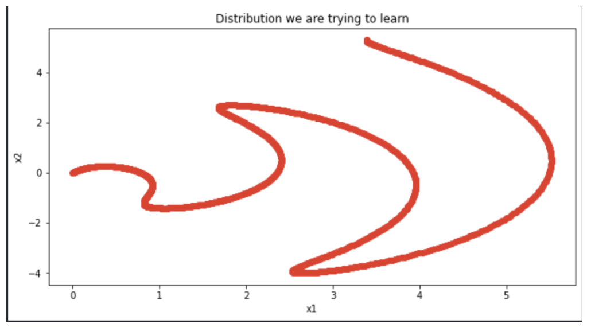
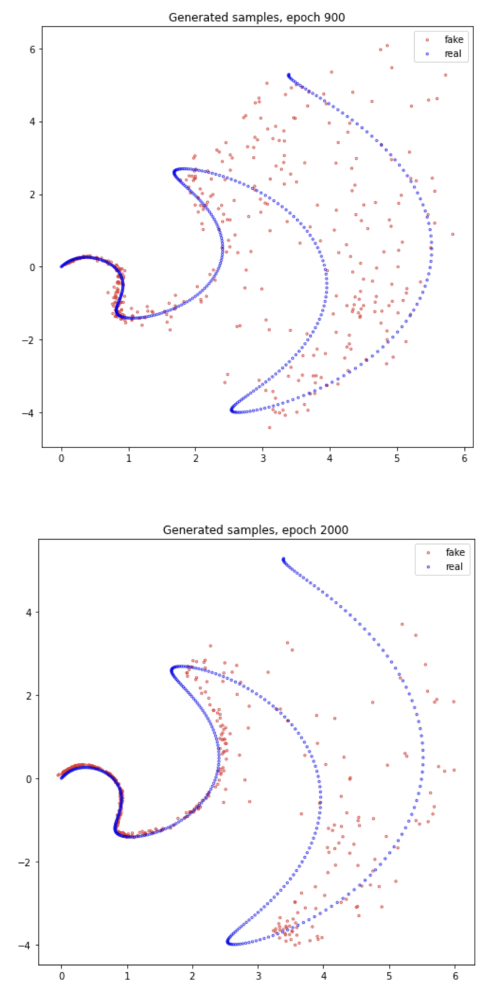
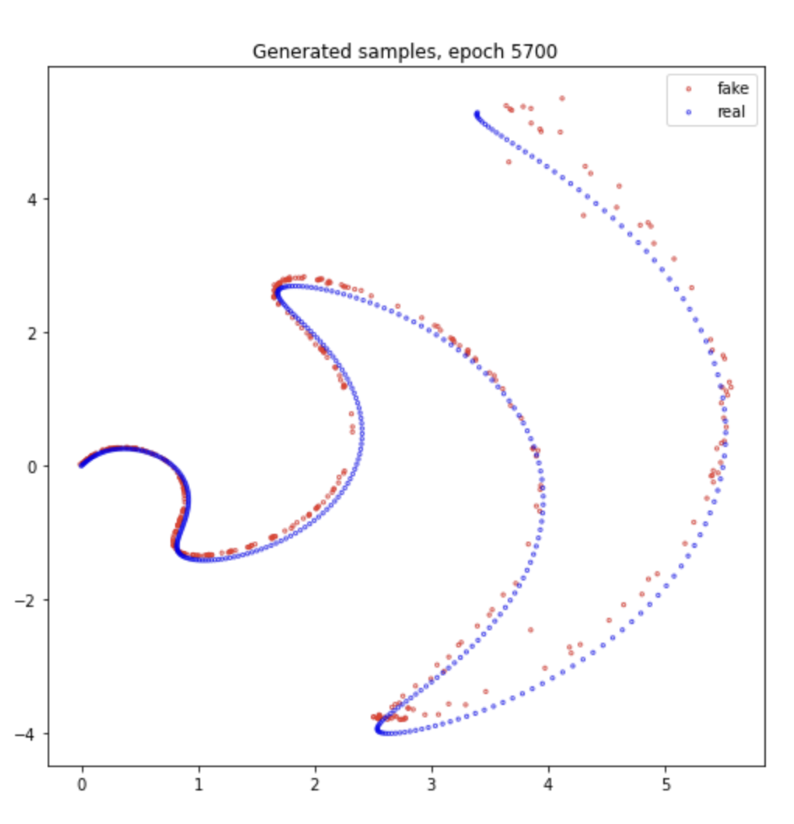
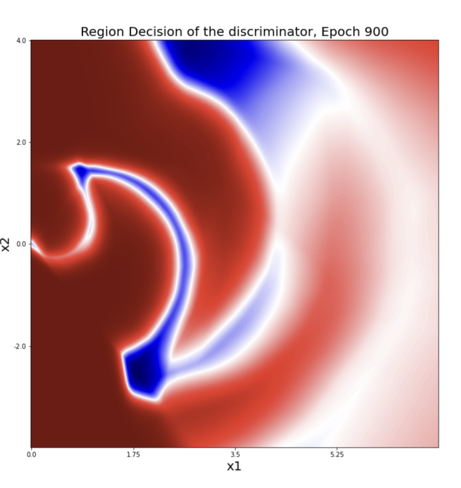
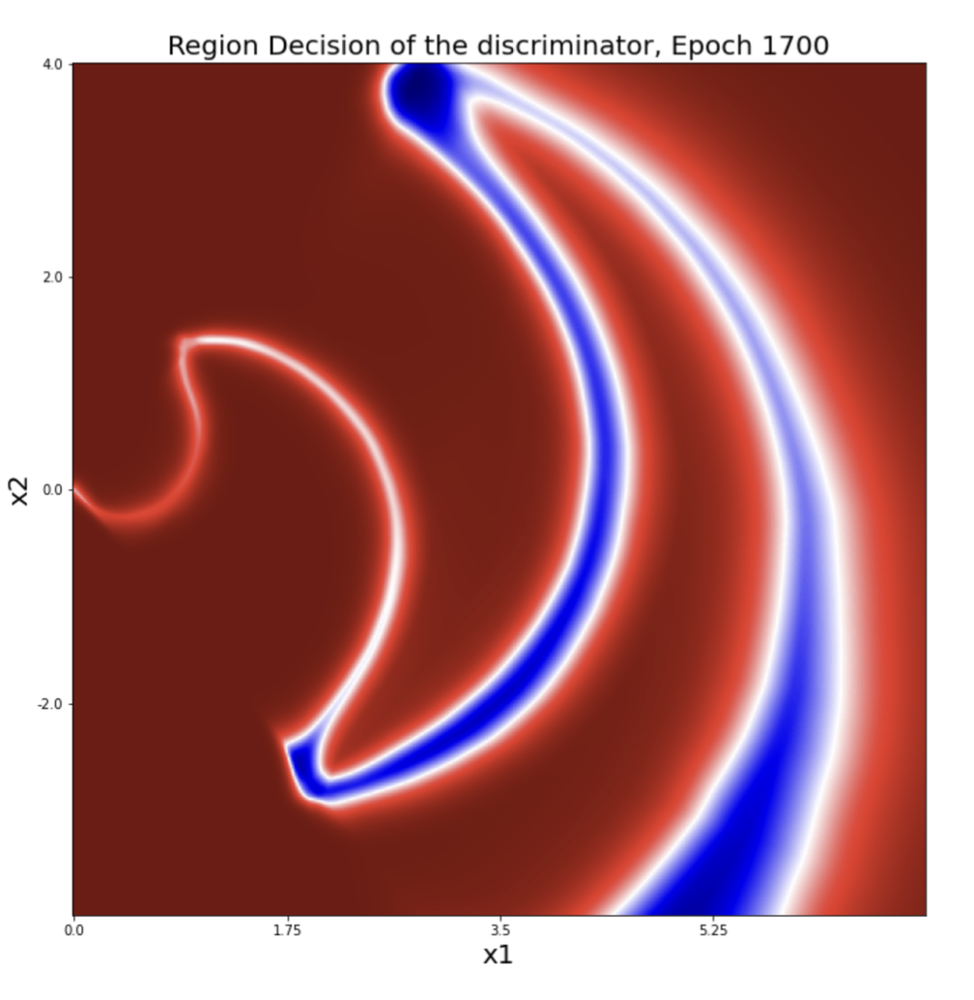
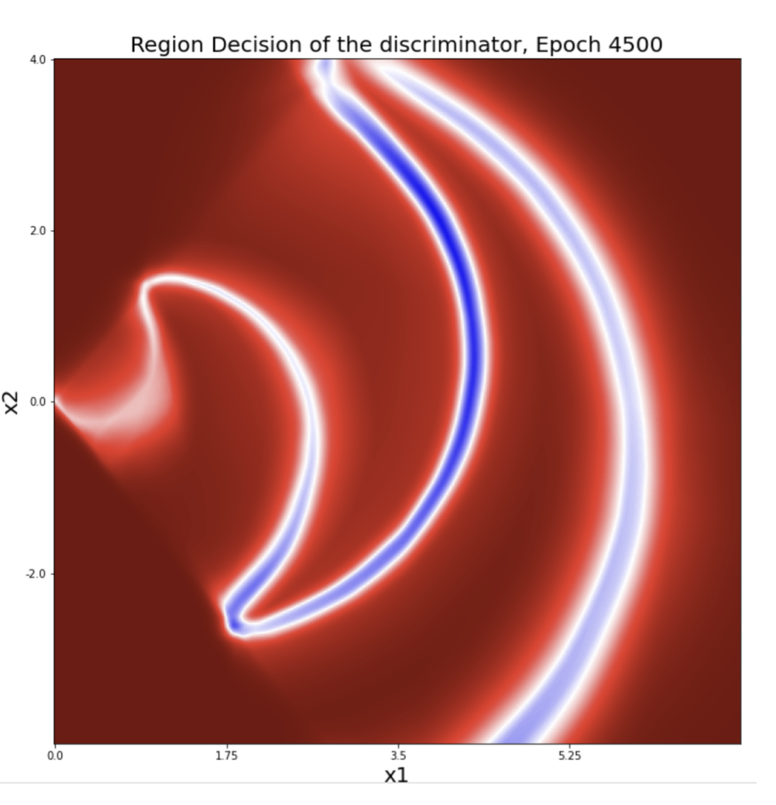
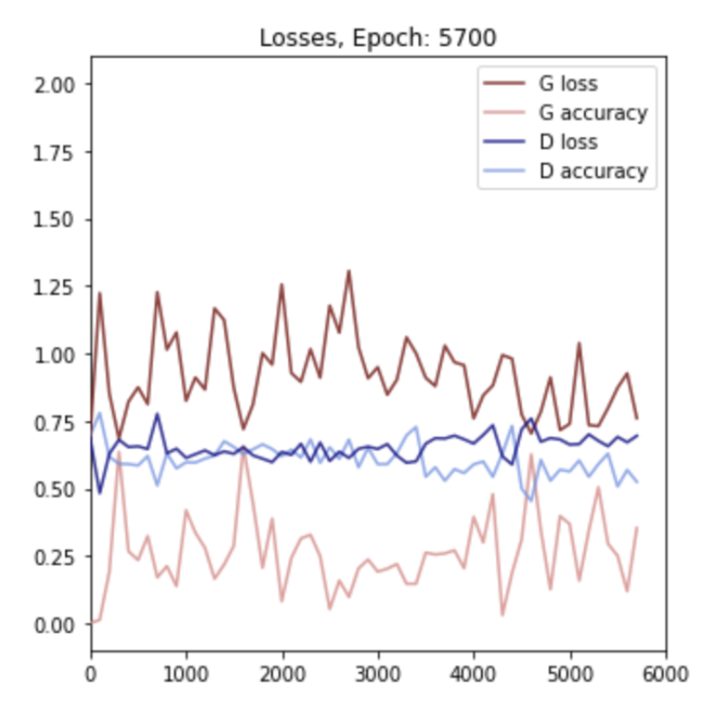

# 🤖 Visualising GANs

In this project I tried to understand how Generative Adversarial Network work in low dimensions.

By visualising the samples generated and the confidence region of the Discriminator, we can develop intuition on what is really h appening during training.
# 🎇Demo

## Here is the target distribution we are trying to learn

## The evolution of the samples generated by the Generator

## The evolution of the Discriminator's confidence region

## Loss

# 🙋🏻‍♂️ Authors

- [@Francois Porcher](https://github.com/FrancoisPorcher)

## 🔗 Links

